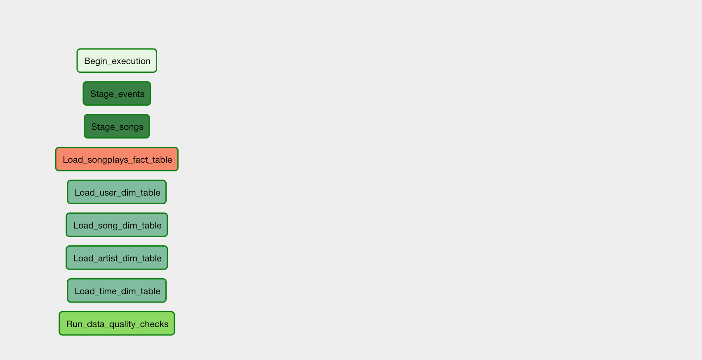

# Data Pipelines with Airflow

This project involves creating custom operators to execute essential functions like staging data, populating a data warehouse, and validating data through the pipeline.

## Initiating the Airflow Web Server
Ensure [Docker Desktop](https://www.docker.com/products/docker-desktop/) is installed before proceeding.

To bring up the entire app stack up, we use [docker-compose](https://docs.docker.com/engine/reference/commandline/compose_up/) as shown below

```bash
docker-compose up -d
```
Visit http://localhost:8080 once all containers are up and running.

## Configuring Connections in the Airflow Web Server UI


On the Airflow web server UI, use `airflow` for both username and password.
* Post-login, navigate to **Admin > Connections** to add required connections - specifically, `aws_credentials` and `redshift`.
* Don't forget to start your Redshift cluster via the AWS console.
* After completing these steps, run your DAG to ensure all tasks are successfully executed.

## Getting Started with the Project
1. The project template package comprises three key components:
   * The **DAG template** includes imports and task templates but lacks task dependencies.
   * The **operators** folder with operator templates.
   * A **helper class** for SQL transformations.

1. With these template files, you should see the new DAG in the Airflow UI, with a graph view resembling the screenshot below:

You should be able to execute the DAG successfully, but if you check the logs, you will see only `operator not implemented` messages.

## DAG Configuration
In the DAG, add `default parameters` based on these guidelines:
* No dependencies on past runs.
* Tasks are retried three times on failure.
* Retries occur every five minutes.
* Catchup is turned off.
* No email on retry.

Additionally, configure task dependencies to match the flow depicted in the image below:


## Developing Operators
To complete the project, build four operators for staging data, transforming data, and performing data quality checks. While you can reuse code from Project 2, leverage Airflow's built-in functionalities like connections and hooks whenever possible to let Airflow handle the heavy lifting.

### Stage Operator
Load any JSON-formatted files from S3 to Amazon Redshift using the stage operator. The operator should create and run a SQL COPY statement based on provided parameters, distinguishing between JSON files. It should also support loading timestamped files from S3 based on execution time for backfills.

### Fact and Dimension Operators
Utilize the provided SQL helper class for data transformations. These operators take a SQL statement, target database, and optional target table as input. For dimension loads, implement the truncate-insert pattern, allowing for switching between insert modes. Fact tables should support append-only functionality.

### Data Quality Operator
Create the data quality operator to run checks on the data using SQL-based test cases and expected results. The operator should raise an exception and initiate task retry and eventual failure if test results don't match expectations.

## Reviewing Starter Code
Before diving into development, familiarize yourself with the following files:
- [plugins/operators/data_quality.py](plugins/operators/data_quality.py)
- [plugins/operators/load_fact.py](plugins/operators/load_fact.py)
- [plugins/operators/load_dimension.py](plugins/operators/load_dimension.py)
- [plugins/operators/stage_redshift.py](plugins/operators/stage_redshift.py)
- [plugins/helpers/sql_queries.py](plugins/helpers/sql_queries.py)
- [dags/final_project.py](dags/final_project.py)

Now you're ready to embark on this exciting journey into the world of Data Pipelines with Airflow!
